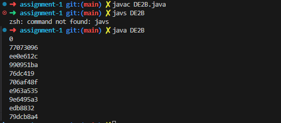

# DE2B CRC32 Table Generation Analysis

## DE2B.java Source Code

```java
// DE2B.java CS5125 cheng 2026
// implements the C code in rfc 1952 make_crcv_table() in Java
// with minimum scopes for all local variables
// print out the first 10 table items in hexadecimal.
// correct if the same as the first 10 constants in table[] of DE2A.java
// Usage: java DE2B

public class DE2B {

    public static void main(String[] args) {

        for (int n = 0; n < 10; n++){ // only compute the first 10 table items
            int c = n;
            for (int k = 0; k < 8; k++){
                // your Java code corresponding to the C code
                if ((c & 1) != 0) {
                   c = 0xEDB88320 ^ (c >>> 1);
                } else {
                   c = c >>> 1;
                }
                // You may not need {, }, or L in your Java code
            }
            System.out.println(Integer.toHexString(c));
        }
    }
}
```

## DE2B Execution Output

```
0
77073096
ee0e612c
990951ba
76dc419
706af48f
e963a535
9e6495a3
edb8832
79dcb8a4
```

## First 10 Entries from DE2A.java Table

```
0x00000000, 0x77073096, 0xee0e612c, 0x990951ba, 
0x076dc419, 0x706af48f, 0xe963a535, 0x9e6495a3,
0x0edb8832, 0x79dcb8a4, ...
```

## Comparison Results

| Index (n) | DE2B Output | DE2A Table Value | Match |
|-----------|-------------|------------------|-------|
| 0         | 0x00000000  | 0x00000000       |$\checkmark$  |
| 1         | 0x77073096  | 0x77073096       | $\checkmark$  |
| 2         | 0xee0e612c  | 0xee0e612c       | $\checkmark$  |
| 3         | 0x990951ba  | 0x990951ba       | $\checkmark$  |
| 4         | 0x076dc419  | 0x076dc419       | $\checkmark$  |
| 5         | 0x706af48f  | 0x706af48f       | $\checkmark$  |
| 6         | 0xe963a535  | 0xe963a535       | $\checkmark$  |
| 7         | 0x9e6495a3  | 0x9e6495a3       | $\checkmark$  |
| 8         | 0x0edb8832  | 0x0edb8832       | $\checkmark$  |
| 9         | 0x79dcb8a4  | 0x79dcb8a4       | $\checkmark$  |

## Analysis

**Perfect match!** All 10 values generated by DE2B exactly match the first 10 entries in the CRC32 table from DE2A.java. The algorithm correctly implements the RFC 1952 CRC32 table generation.


## Terminal Output Screenshot Code compile and run

