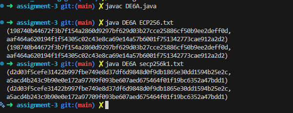

# DE6A.java - Elliptic Curve Cryptography

## Overview
This program implements Elliptic Curve Cryptography (ECC) for key exchange using the Diffie-Hellman protocol.

## Code

```java
// DE6A.java CS5125/6025 Cheng 2026
// Elliptic curve cryptography
// Usage: java DE6A ECP256.txt/secp256k1.txt

import java.math.*;
import java.io.*;
import java.util.*;

class Point{
  public BigInteger x; 
  public BigInteger y;
  static Point O = new Point(null, null);
  public Point(BigInteger xx, BigInteger yy){ x = xx; y = yy; }
  public String toString(){
    return this.equals(O) ? "O" :
    "(" + x.toString(16) + ",\n" + y.toString(16) + ")";
  }
}

public class DE6A{

  static BigInteger three = new BigInteger("3");  
  static final int privateKeySize = 255;
  BigInteger p; // modulus
  Point G; // base point
  BigInteger a;  // curve parameter
  BigInteger b;  // curve parameter
  BigInteger n;  // order of G
  BigInteger privateKeyA;
  Point publicKeyA;
  BigInteger privateKeyB;
  Point publicKeyB;
  Random random = new Random();

void readCurveSpecs(String filename){
    Scanner in = null;
    try {
     in = new Scanner(new File(filename));
    } catch (FileNotFoundException e){
      System.err.println(filename + " not found");
      System.exit(1);
    }
    p = new BigInteger(in.nextLine(), 16);
    n = new BigInteger(in.nextLine(), 16);
    a = new BigInteger(in.nextLine(), 16);
    b = new BigInteger(in.nextLine(), 16 );
    G = new Point(new BigInteger(in.nextLine(), 16), new BigInteger(in.nextLine(), 16));
    in.close();
}

Point add(Point P1, Point P2){
   if (P1.equals(Point.O)) return P2;
   if (P2.equals(Point.O)) return P1;
   if (P1.x.equals(P2.x)) if (P1.y.equals(P2.y)) return selfAdd(P1);
                          else return Point.O;
   BigInteger t1 = P1.x.subtract(P2.x).mod(p);
   BigInteger t2 = P1.y.subtract(P2.y).mod(p);
   BigInteger k = t2.multiply(t1.modInverse(p)).mod(p); // slope
   t1 = k.multiply(k).subtract(P1.x).subtract(P2.x).mod(p); // x3
   t2 = P1.x.subtract(t1).multiply(k).subtract(P1.y).mod(p); // y3
   return new Point(t1,t2);
}   

Point selfAdd(Point P){
     if (P.equals(Point.O)) return Point.O; // O+O=O
     if (P.y.equals(BigInteger.ZERO)) return Point.O;
     BigInteger t1 = P.y.add(P.y).mod(p);  // 2y
     BigInteger t2 = P.x.multiply(P.x).mod(p).multiply(three).add(a).mod(p); // 3xx+a
     BigInteger k = t2.multiply(t1.modInverse(p)).mod(p); // slope or tangent
     t1 = k.multiply(k).subtract(P.x).subtract(P.x).mod(p); // x3 = kk-x-x
     t2 = P.x.subtract(t1).multiply(k).subtract(P.y).mod(p); // y3 = k(x-x3)-y
     return new Point(t1,t2);
}

Point multiply(Point P, BigInteger n){
     if(n.equals(BigInteger.ZERO)) return Point.O;  
     int len = n.bitLength();  // position preceding the most significant bit 1
     Point product = P;
     for(int i = len - 2; i >= 0; i--){
        product = selfAdd(product); 
        if (n.testBit(i)) product = add(product, P);
     }
     return product;
  }

 void checkParameters(){
   BigInteger lhs = G.y.multiply(G.y).mod(p);
   BigInteger rhs = G.x.modPow(three, p).add(G.x.multiply(a).mod(p)).add(b).mod(p);
   System.out.println(lhs.toString(16));
   System.out.println(rhs.toString(16));  // These two lines should be the same
   Point power = multiply(G, n);
   System.out.println(power);  // This should be O
 }

 void generateKeys(){
    privateKeyA = new BigInteger(privateKeySize, random);
    publicKeyA = multiply(G, privateKeyA);
    privateKeyB = new BigInteger(privateKeySize, random);
    publicKeyB = multiply(G, privateKeyB);
 }

 void sharedSecret(){  // Figure 10.7 of book
    Point KA = multiply(publicKeyB, privateKeyA);  // secret computed by A
    Point KB = multiply(publicKeyA, privateKeyB);  // secret computed by B MODIFIED LINE
    System.out.println(KA);
    System.out.println(KB);
 }  
   
   
public static void main(String[] args){
   if (args.length < 1){
	System.err.println("Usage: java DE6A ECP256.txt/secp256k1.txt");
	return;
   }
   DE6A de6 = new DE6A();
   de6.readCurveSpecs(args[0]);
   de6.generateKeys();
   de6.sharedSecret();
 
}
}
```

## Key Implementation Detail

The critical line in the `sharedSecret()` method demonstrates the Diffie-Hellman key exchange:

```java
Point KB = multiply(publicKeyA, privateKeyB);  // secret computed by B
```

**This line is the core of the ECDH protocol:** Party B computes the shared secret by multiplying Party A's public key with Party B's private key. Due to the mathematical properties of elliptic curves, this produces the same result as Party A's computation (`KA = multiply(publicKeyB, privateKeyA)`).

## Execution Results

The program demonstrates that both parties arrive at the same shared secret point:



As shown in the image, both `KA` and `KB` produce identical coordinate values, proving the successful establishment of a shared secret through the elliptic curve Diffie-Hellman key exchange.
