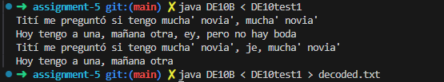

# Assignment 5 - AES Decryption (DE10B)

## Changes Made to DE10B.java

### 1. Added `invShifts` array

Added the inverse shift permutation array, which is the inverse of the `shifts` array used in DE10A's `shiftRows()`:

```java
static int[] invShifts = {0, 13, 10, 7, 4, 1, 14, 11, 8, 5, 2, 15, 12, 9, 6, 3};
```

### 2. Implemented `invShiftRows()`

This function was empty and needed to be filled in. It applies the inverse row shift by permuting the state using the `invShifts` array:

```java
void invShiftRows(){
  int[] temp = new int[blockSize];
  for (int i = 0; i < blockSize; i++) temp[i] = state[invShifts[i]];
  for (int i = 0; i < blockSize; i++) state[i] = temp[i];
}
```

### 3. Implemented `invAddRoundKey(int round)`

Filled in the round key index to apply keys in reverse order during decryption. The key expression `numberOfRounds - 1 - round` ensures that round 0 in the decoder uses the last encryption round key, and round 10 uses the first:

```java
void invAddRoundKey(int round){
   for (int k = 0; k < blockSize; k++) 
      state[k] ^= roundKey[numberOfRounds - 1 - round][k];
}
```

| Decryption Round | Round Key Used |
|------------------|----------------|
| 0                | roundKey[10]   |
| 1                | roundKey[9]    |
| ...              | ...            |
| 10               | roundKey[0]    |

## Test Run

```
java DE10B < DE10test1 > decoded.txt
```



## Decoded Output

```
Tití me preguntó si tengo mucha' novia', mucha' novia'
Hoy tengo a una, mañana otra, ey, pero no hay boda
Tití me preguntó si tengo mucha' novia', je, mucha' novia'
Hoy tengo a una, mañana otra
```
