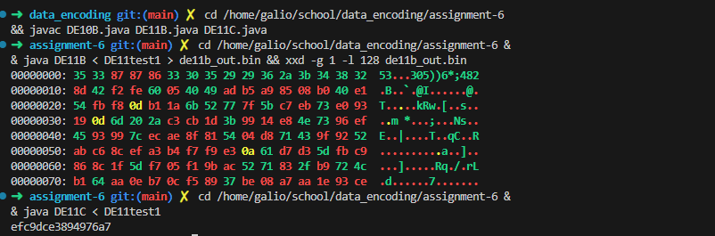

# Run Summary

## Changes Made (Assignment-Based)
- DE11B: CBC `decrypt()` arrangement using the required five calls.
- DE11C: CMAC last-block handling (choose `K1` for a full block, `K2` for a padded block).
- Built DE10B, DE11B, and DE11C.
- Ran DE11B on DE11test1 and captured a hex preview of the output.
- Ran DE11C on DE11test1 and captured the CMAC output.

## Code Segments Implemented

DE11B CBC decrypt arrangement (from [assignment-6/DE11B.java](assignment-6/DE11B.java)):

```java
void decrypt(){  // inverse of DE11A.encrypt()
	 int[] previousBlock = new int[blockSize];
	 for (int k = 0; k < blockSize; k++) previousBlock[k] = 0;
	 int[] currentBlock = new int[blockSize];
	 while (readBlock() > 0){
		copyBlock(currentBlock, state);
			blockDecipher();
			addBlock(state, previousBlock);
			writeBlock();
			copyBlock(previousBlock, currentBlock);
	 }
	 System.out.flush();
 }
```

DE11C CMAC last-block handling (from [assignment-6/DE11C.java](assignment-6/DE11C.java)):

```java
			if (lastBlock){
				if (len == blockSize) addBlock(state, K1);  // complete last block
				else addBlock(state, K2);                  // padded last block
			}
```

## Run Results
DE11B (hex preview, first 128 bytes):

```
00000000: 35 33 87 87 86 33 30 35 29 29 36 2a 3b 34 38 32  53...305))6*;482
00000010: 8d 42 f2 fe 60 05 40 49 ad b5 a9 85 08 b0 40 e1  .B..`.@I......@.
00000020: 54 fb f8 0d b1 1a 6b 52 77 7f 5b c7 eb 73 e0 93  T.....kRw.[..s..
00000030: 19 0d 6d 20 2a c3 cb 1d 3b 99 14 e8 4e 73 96 ef  ..m *...;...Ns..
00000040: 45 93 99 7c ec ae 8f 81 54 04 d8 71 43 9f 92 52  E..|....T..qC..R
00000050: ab c6 8c ef a3 b4 f7 f9 e3 0a 61 d7 d3 5d fb c9  ..........a..]..
00000060: 86 8c 1f 5d f7 05 f1 9b ac 52 71 83 2f b9 72 4c  ...].....Rq./.rL
00000070: b1 64 aa 0e b7 0c f5 89 37 be 08 a7 aa 1e 93 ce  .d......7.......
```

DE11C CMAC:

```
efc9dce3894976a7
```


