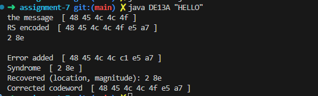

# Assignment 7 Submission

## Overview
DE13A.java performs Reed Solomon error correction with $G = (x - 1)(x - 2)$. One byte error is randomly generated and two syndromes are computed. I added code to recover the one-term error polynomial by determining the location and magnitude of the byte error.

## Key Changes
- Compute $S_0$ and $S_1$ from the syndrome polynomial.
- Use $S_0$ as the error magnitude and compute $\alpha^k = S_1 / S_0$ to find the error location.
- Apply the correction by XORing the recovered error back into the codeword.

## Code Added
```java
int s0 = Syndrome.coeff[0]; // S0 = C'(1) = e
int s1 = Syndrome.coeff[1]; // S1 = C'(alpha) = e * alpha^k

int magnitude = s0;                 // e = S0
int invS0 = f.multiplicativeInverse(s0);
int ratio = f.multiply(s1, invS0);  // ratio = alpha^k

int location = f.log[ratio];        // k = log_alpha(ratio)

System.out.println("Recovered (location, magnitude): " + location + " " + Integer.toHexString(magnitude));

// Apply correction (XOR same error value at that position)
HashMap<Integer, Integer> recovered = new HashMap<>();
recovered.put(location, magnitude);

Polynomial corrected = CplusE.addError(recovered);
corrected.display("Corrected codeword ");
```

## Example Test Run



```
the message  [ 48 45 4c 4c 4f ]
RS encoded  [ 48 45 4c 4c 4f e5 a7 ]
2 8e

Error added  [ 48 45 4c 4c c1 e5 a7 ]
Syndrome  [ 2 8e ]
Recovered (location, magnitude): 2 8e
Corrected codeword  [ 48 45 4c 4c 4f e5 a7 ]
```
